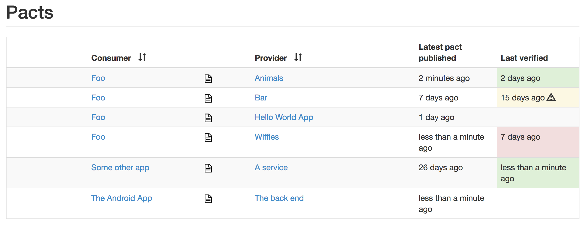
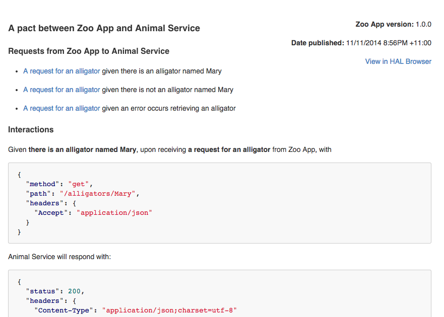

## CDCT, or Consumer-Driven Contract Testing

Consumer-driven contract tests are actually integration tests that are targetting your API, whether it's REST-based or messaging-based.
Imagine you're working on an application that exposes its data using a REST API.
Another team is using your exposed data for some functionality that they are providing.

In order to guarantee that the functionality of the other team their application doesn't break if we make changes to our API, we create a contract between the two teams.
Key in this setup is that the contracts are defined by the consumer of your API instead of the developer who wrote the implementation of a certain functionality.

With this approach we can generate tests by using those consumer-driven contracts, and verify whether we're going to break any of our consumers' applications.
You can find a couple of interesting and useful links on the bottom of this post which go further into detail.

Spring Cloud Contract provides us with JVM-based libraries, allowing us to generate Groovy contracts, package them as a jar, and upload them to an artifact repository like Nexus or Artifactory.
Great, but that means we can only use these contracts between two parties that are using a JVM language.
What if the consumer of our API is a NodeJS or .NET microservice, or even an Angular application?
For consumers or producers written in other languages, the lack of library support might be a concern.

With the latest Spring Cloud release, that's a thing of the past!

## Spring Cloud Contract, meet Pact

The first release candidate of Spring Cloud Finchley, which was released on the 25th of April, also ships the first release candidate of Spring Cloud Contract.

<blockquote class="twitter-tweet tw-align-center" data-dnt="true"><p lang="en" dir="ltr">Our first release candidate of the Spring Cloud Finchley release train has been released.  Checkout the blog post for more information and as always feedback is welcome! <a href="https://t.co/8TK0tudkzr">https://t.co/8TK0tudkzr</a></p>— Spring Cloud (@springcloud) <a href="https://twitter.com/springcloud/status/989122422635925504">April 25, 2018</a></blockquote>

Spring Cloud Contract has updated its support for <a href="http://pact.io/" target="_blank">Pact</a> and added the support to connect to a <a href="https://github.com/pact-foundation/pact_broker" target="_blank">Pact broker</a>.
The Pact broker acts as a repository for sharing the Pact contracts and verification results.
The most awesome feature in my opinion is the visualisation of the contracts between all known parties.
In the UI you can see the last time there was a new version of a contract published, when it was verified and what status it had, and last but not least the details of the contract.



```grid|2


```

Simply add the `spring-cloud-contract-pact` dependency, which will add the Pact Converter and Pact Stub Downloader, together with some configuration and you're good to go!

The Pact contracts will be retrieved from the Pact broker and converted to Spring Cloud Contract contracts for you, so these in turn can be used to generate stubs and tests.
It's also possible to write Spring Cloud Contract contracts, convert them to Pact contracts and upload them to the Pact broker.

The upside to it is that these contracts are in fact language agnostic as opposed to Spring Cloud Contract, the downside to it is that it lacks some functionality regarding messaging compared to Spring Cloud Contract.
Currently Pact contracts up until v4 are supported, which means that both request-response and messaging contracts can be used.
Note that not all functionality is supported though, as is described in <a href="https://cloud.spring.io/spring-cloud-contract/single/spring-cloud-contract.html#pact-converter" target="_blank">this section</a> of the reference documentation.

A typical workflow to define such contracts could look like this:
- The consumer of the data writes a test for the feature by doing TDD. In this test the contract is defined which will be used as a stub.
- Next up the missing implementation is written.
- When we push our changes to Git our CI pipeline is triggered, in which we'll upload all defined contracts to a central artifact repository, eg. a Pact broker, after all our tests have been run.
- After our code's been pushed, we'll clone the producer's application.
- We create a test that uses the newly added CDC and file a pull request.
- The team that works on the producer's application can take over the pull request and add changes where necessary.

In case you want to go the extra mile: you can also use the same approach for consumer-driven changes within the producer's application!
If you want a new REST endpoint or a message that will be delivered through some messaging system like Kafka or RabbitMQ, you can add an initial implementation of the missing functionality in the pull request.
The other team then only needs to review the changes and add some adjustments if needed.
Both teams can really benefit from such workflow: the consumer's team doesn't need to wait until the producer's team has time to create the implementation, while the producer's team can keep their focus on what's on their product backlog.

## Useful links

The <a href="https://cloud.spring.io/spring-cloud-contract/reference/html/getting-started.html#getting-started-three-second-tour" target="_blank">three-second</a> tour gives you a nice very brief walkthrough of Spring Cloud Contract.

This session about <a href="https://www.youtube.com/watch?v=JEmpIDiX7LU" target="_blank">Consumer Driven Contracts and Your Microservice Architecture</a> by Marcin Grzejszczak (<a href="https://twitter.com/mgrzejszczak" target="_blank">@mgrzejszczak</a>) and Adib Saikali (<a href="https://twitter.com/asaikali" target="_blank">@asaikali</a>).

A <a href="https://cloud.spring.io/spring-cloud-contract/single/spring-cloud-contract.html#_step_by_step_guide_to_consumer_driven_contracts_cdc" target="_blank">step-by-step guide</a> to Consumer Driven Contracts with Spring Cloud Contract.

<a href="https://github.com/pact-foundation/pact-js" target="_blank">Implementation of the consumer driven contract library Pact for Javascript</a>, from creating a test to generating the contract and uploading it to the Pact broker.